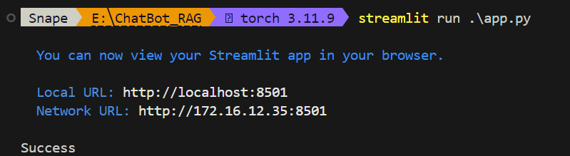
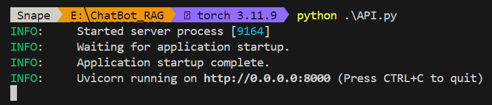
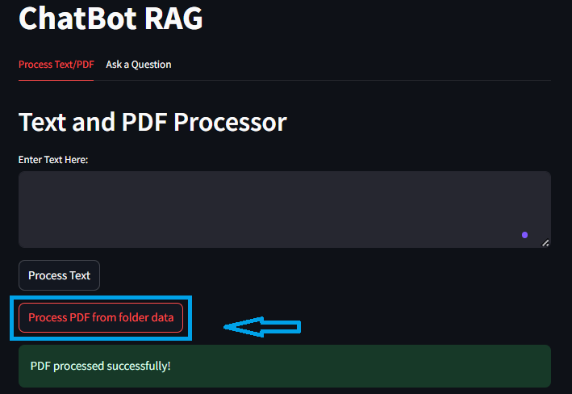
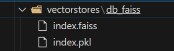
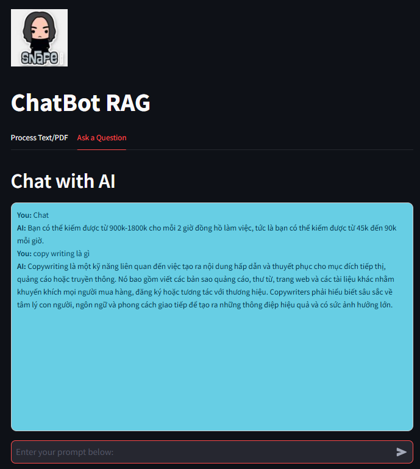

# ChatBot RAG

## Installation and Dependencies

1. Clone this repository:

```bash
git 
cd 
```

2. Setup environment:

```bash
!pip install -r requirements.txt
```

3. Download weight 
	- vinallama-7b-chat_q5_0.gguf :[download here](https://huggingface.co/vilm/vinallama-7b-chat-GGUF/tree/main) 
	- all-MiniLM-L6-v2-f16.gguf [download here](https://huggingface.co/caliex/all-MiniLM-L6-v2-f16.gguf/tree/main)
	
## Usage

1. Put all PDF files in data folder and model files in model folder:

``` css
E:\ChatBot_RAG:
|-- assets/
    |-- images/
        |-- createdVecDB.png
        |-- result.png
        |-- run_api.png
        |-- run_streamlit.png
        |-- snape.jpg
        |-- VecDB.png
|-- data/
    |-- Ebook Copywriting - Minh Xin Chào.pdf
|-- models/
    |-- all-MiniLM-L6-v2-f16.gguf
    |-- vinallama-7b-chat_q5_0.gguf
|-- notebooks/
    |-- vectorstores/
    |-- app_transform_data.py
    |-- prepare_vec_DB.ipynb
    |-- printTree.py
    |-- utils.py
|-- vectorstores/
    |-- db_faiss/
        |-- index.faiss
        |-- index.pkl
|-- .gitignore
|-- API.py
|-- app.py
|-- prepare_vector_db.py
|-- README.md
|-- remove_vector_store.py
|-- requirements.txt
```

**Explain**:
- **`assets/`:** Contains images and resources used for documentation or UI.
- **`data/`:** Stores input PDF files for processing.
- **`models/`:** Holds pre-trained model files required for embedding and chat responses.
- **`notebooks/`:** Contains development scripts and Jupyter notebooks for experimentation.
- **`vectorstores/`:** Stores vector database files for searching.
- Contains development scripts and Jupyter notebooks for experimentation.
	- **`.gitignore`**: Specifies files or folders to ignore in version control.
	- **`API.py`**: Backend API to handle queries and serve data.
	- **`app.py`**: Streamlit application for the user interface.
	- **`prepare_vector_db.py`**: Script to prepare the vector database.
	- **`remove_vector_store.py`**: Script to clean up the vector database.
	- **`requirements.txt`**: Lists dependencies required for the application
	- **`README.md`**: Documentation for the project.


2. Run application:
	Open **two terminals** and execute the following commands:

**Terminal 1** (Run the Streamlit app):

```bash
streamlit run .\app.py
```


**Terminal 2** (Run the API):
```bash
python .\API.py
```

## Input: text, pdf file, folder contain all pdf files



### **Post-processing** 
- After running the application, a `vectorstores` folder will be created automatically.

# Ask a question with chat
- Once the setup is complete, you can ask questions through the chat interface.
	
